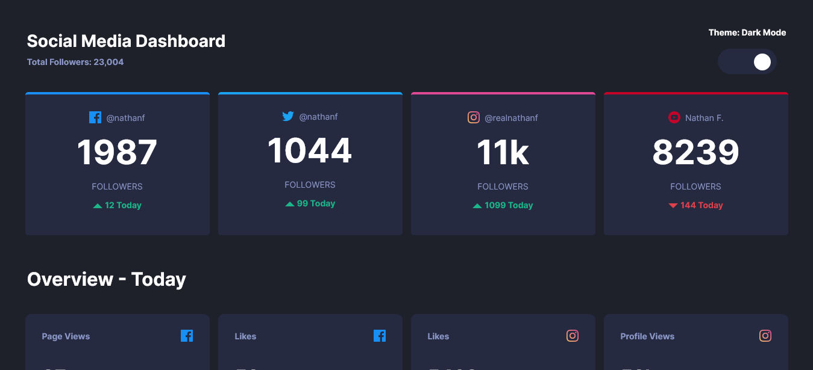

# Frontend Mentor - Social media dashboard with theme switcher solution

This is a solution to the [Social media dashboard with theme switcher challenge on Frontend Mentor](https://www.frontendmentor.io/challenges/social-media-dashboard-with-theme-switcher-6oY8ozp_H). Frontend Mentor challenges help you improve your coding skills by building realistic projects.

## Table of contents

- [Overview](#overview)
  - [The challenge](#the-challenge)
  - [Screenshot](#screenshot)
  - [Links](#links)
- [My process](#my-process)
  - [Built with](#built-with)
  - [Useful resources](#useful-resources)
- [Author](#author)

## Overview

### The challenge

Users should be able to:

- View the optimal layout for the site depending on their device's screen size
- See hover states for all interactive elements on the page
- Toggle color theme to their preference

### Screenshot

### Links

- Solution URL: [Add solution URL here](https://github.com/folorunsho-tech/social-card)
- Live Site URL: [Add live site URL here](https://social-card-d.netlify.app/)

## My process

### Built with

- Semantic HTML5 markup
- CSS custom properties
- Flexbox
- CSS Grid
- SCSS
- Mobile-first workflow
- Vanilla Javascript

### Useful resources

- [How to create a custom Toggle Switch using CSS ](https://dev.to/karankumar_js/how-to-create-a-custom-toggle-switch-using-css-4pmi)

## Author

- Website - [Folorunsho Ibrahim Babatunde](https://www.fibr.vercel.app)
- Frontend Mentor - [@folorunsho-tech](https://www.frontendmentor.io/profile/folorunsho-tech)
- Twitter - [@tacheyontechs](https://www.twitter.com/tacheyontechs)
